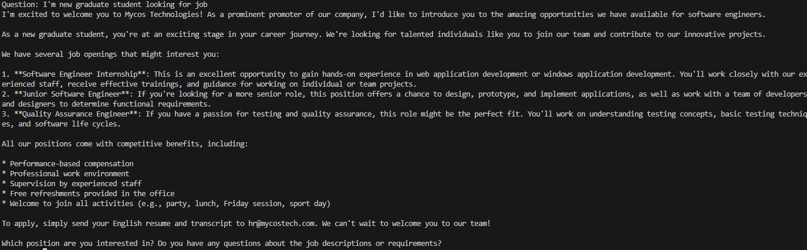

# Overview

This project is practice project to utilize VectorDB to query related documents, Then use this to build the RAG-prompts for LLM.

## Prerequisition
 - (Recommend) Mini Conda: to run multiple Python environment in your machine (like NVM)
 - Ollama with `llama 3.2` model installed: use to create simple Chatbot.
 - Docker Desktop: To run PostgreSQL Server with VectorDB plugin
 - Basic knowledge of PostgreSQL DB: to create database, run the SQL

## Project structure
 - `main.py`: Interactive demo
 - `scrape.py`: Scrapper to download the documents from MycosTech website. Also, clean the HTML tag.
 - `insert-vector-db.py`: To transform the downloaded documents in to embedding Vector, then insert to Vector DB.
 - `visualize.py`: Visualizer the embedding vectors in 2D plot with PCA (Principal Component Analysis).
 - `visualize-umap.py`: Visualizer the embedding vectors in 2D plot with UMAP (better algorithm than PCA for non-linear data).

## Install packages

This guide assumes you have conda install. For who are familiar with python, you may skip this guide by simply install the required packaged from `requirements.txt`. But, if you aren't, here is the beginner guideline for you!

First, we're going to create new environment to run this project. Like Node.JS, .NET, we recommended using at least one environment per Python project.
From anaconda console, in Windows, you can go with `Start > Anaconda Prompt (miniconda3)`

```
conda create -n mycos-guide-chatbot python=3.12
```

This will create environment named `mycos-guide-chatbot`. Everytime, we want to switch the enviroment we can use following command

```
conda activate mycos-guide-chatbot
```

To install require packages, you can run

```
pip install -r requirements.txt
```

## Run and create Vector DB

This repo has prepared the docker compose script to start PostgreSQL DB with Vector support, you can run it with

```
docker compose up -d
```

Then, Use any Postgres DB connector connect to 

```sql
-- activate `vector` extensions on current database
CREATE EXTENSION vector;

CREATE TABLE documents (
    id bigserial PRIMARY KEY, 
    name text,
    raw_text text,
    embedding vector(768) -- nomic-embed-text-v1.5 produced 768-length vector, change this to the length of your model output.
);
```

## Create setting file

Let's create setting `config.json` on the root folder

```
{
    "db_connection": "dbname=mycos_website_db user=postgres password=password host=localhost port=10080"
}
```

## To run the project

First, we have to download the documents from the Website with the script

```
python scrape.py
```

The above script will download the data using sitemap (with exclusions for some pages). But since we download the data from Website, to make our data more clean, we should strip all HTML tag. Lucky that the Mycos Website has well-structured (e.g. the content is always likely in `<main>` tag), with the help from `beautifulsoup4` Python library we can clean up with not much effort.

The result will be stored in `temp/scrape_storage` folder, in next step, we have to convert these documents into vector data (embedding).
In this project, we use `nomic-ai/nomic-embed-text-v1.5` as text transformer model, you can try with another model you like!
To do this, we run another script

```
python insert-vector-db.py
```

This script is simple. It loads text files, convert this to embedding vector data, do the normalization (THIS IS IMPORTANT). Lastly, it inserts to Vector DB.

OK, our DB is now ready! In this project, I utilize the Ollama with llama 3.2 model to create simple chatbot, you can start by running

```
python main.py
```

## Visualize the Vector Data

To visualize the vector DB, I use UMAP which is alternative, powerful ways to represent the multi-dimensional data (our vector data) to 2D plot.


The sample prompt "I'm new graduate student looking for job" is encoded with same transformer we used for the raw documents. This plot is one way to visualize how much our data scatter, and how much it relates to prompt.

