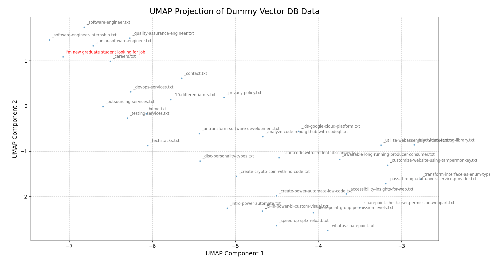

# Overview

This project is a practice project designed to utilize VectorDB for querying related documents. The retrieved documents are then used to build RAG prompts for the LLM.

## Prerequisites:
- **(Recommended)** Mini Conda: Allows you to run multiple Python environments on your machine (similar to NVM).
- **Ollama with `llama 3.2` model installed**: Used to create a simple chatbot.
- **Docker Desktop**: Required to run a PostgreSQL Server with the VectorDB plugin.
- **Basic knowledge of PostgreSQL**: Enables you to create databases and execute SQL queries.

## Project Structure
- `main.py`: Interactive demo.
- `scrape.py`: Scraper that downloads documents from a website and cleans HTML tags.
- `insert-vector-db.py`: Transforms downloaded documents into embedding vectors, then inserts them into a VectorDB.
- `visualize.py`: Visualizes embedding vectors in a 2D plot using PCA (Principal Component Analysis).
- `visualize-umap.py`: Visualizes embedding vectors in a 2D plot using UMAP (a better algorithm than PCA for non-linear data).

## Install Packages

This guide assumes that you have Conda installed. If you're already familiar with Python, you can skip this guide and simply install the required packages from `requirements.txt`. However, if you're new to Python, here's a beginner-friendly guideline for you!

First, we'll create a new environment to run this project. Like Node.js or .NET, we recommend using a separate environment for each Python project. 

On Windows, open the Anaconda console by navigating to:
`Start > Anaconda Prompt (miniconda3)`

Run the following command to create a new environment:

```
conda create -n mycos-guide-chatbot python=3.12
```

This will create an environment named `mycos-guide-chatbot`. Whenever you want to switch to this environment, use the following command:

```
conda activate mycos-guide-chatbot
```

To install the required packages, run:

```
pip install -r requirements.txt
```

## Run and Create a VectorDB

This repository includes a Docker Compose script to start a PostgreSQL database with Vector support. You can run it using the following command:

```
docker compose up -d
```

This will run PostgreSQL DB which can be accessed on `localhost`, port `10080` with username = `postgres`, password = `password`

Then, use any PostgreSQL DB connector to connect to the database `mycos_website_db`, then run this below script.

```sql
-- activate `vector` extensions on current database
CREATE EXTENSION vector;

CREATE TABLE documents (
    id bigserial PRIMARY KEY, 
    name text,
    raw_text text,
    embedding vector(768) -- nomic-embed-text-v1.5 produced 768-length vector, change this to the length of your model output.
);
```

## Create a Configuration File

Create a `config.json` file in the root folder. This file is required by the Python scripts in this project.

```
{
    "db_connection": "dbname=mycos_website_db user=postgres password=password host=localhost port=10080"
}
```

## Running the Project

First, we need to download documents from the website using the following script:

```
python scrape.py
```

This script retrieves data using a sitemap while excluding certain pages. Since the data comes from a website, we should clean it by removing all HTML tags. Fortunately, the Mycos website is well-structured (e.g., content is consistently placed within the `<main>` tag), making cleanup easier with the `beautifulsoup4` Python library.

The processed data will be stored in the `temp/scrape_storage` folder. Next, we need to convert these documents into vector data (embeddings). 

For this project, we use the `nomic-ai/nomic-embed-text-v1.5` model for text transformation, but feel free to experiment with other models! To generate embeddings, run the following script:

```
python insert-vector-db.py
```

This script is straightforward. It loads text files, converts them into embedding vectors, performs normalization (**which is crucial**), and finally inserts them into the VectorDB.

Now, our database is ready! This project utilizes Ollama with the `llama 3.2` model to create a simple chatbot. You can start the chatbot by running:

```
python main.py
```

## Visualizing the Vector Data

To visualize the VectorDB, I use UMAP, an alternative and powerful method for representing multi-dimensional data (our vector embeddings) in a 2D plot.



For example, the sample prompt **"I'm a new graduate student looking for a job"** is encoded using the same transformer model we applied to the raw documents. This plot provides insight into how our data is distributed and how closely it relates to the given prompt.


